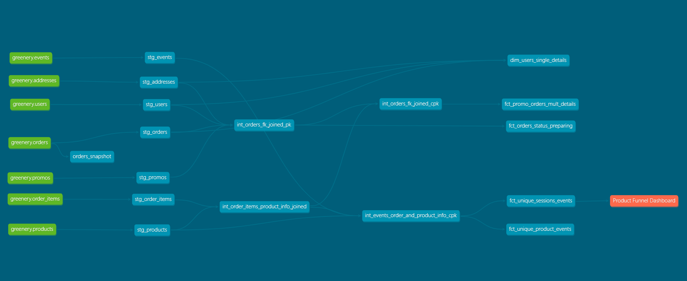

# co:rise Analytics Engineering with dbt

## Course Material

### Week 1
* Understand where dbt fits into the modern data stack, and why it is a core skill for Analytics Engineers
* Run dbt in the command line and save your work to github with git
* Start building a dbt project, and running dbt models against source data in a data warehouse. (This is super cool because being able to do it is foundational to becoming a successful Analytics Engineer!)

### Week 2
* Implement best practices for creating model layers in dbt projects,
* Test data using dbt,
* Defensively code against “bad” data,
* Know which questions to ask about key business metrics using the data we modeled in Week 1, and
* Build model layers and dbt tests into your project

### Week 3
* Use Jinja and macros to create functions with SQL,
* Use Hooks and operations to strategically run SQL and macros without needing to repeat your code, and
* Use dbt packages to install community-built dbt macros, models, and tests 
directly in our projects.

### Week 4
* Understand dbt Snapshots, how they work, and when to use them
* Create a dbt model to answer product funnel questions
* Be able to understand how and when to use dbt exposures
* How dbt can complement traditional data analysis
* Be aware of the various options for running dbt in production
* Understand the various dbt artifacts that are available, and how they can be used

## The Project

**greenery** is a (mock) e-commerce start up that sells plants. As the Analytics Engineer for **greenery**, I have used dbt to transform and model our data to better serve our company. I have prepared the data to be ready for use in BI tools or directly queried to accurately and efficiently answer business inquiries. 

### Project DAG
Using dbt's best practices the data has been structured as so:

> * Source models (src_) have been lightly transformed to create stage versions (stg_).
>   * The general naming convention of stage models are:
>
>                  stg _ [source_table_name]
> * Stage models have been transformed into intermediate tables (int_). 
>   * Intermediate models are pieces of reusable logic that replace the same sql that exist in multiple dimension/fact (dim_/fct_) tables. 
>   * The general naming convention of intermediate models are: 
> 
>                  int _ [base_table] _ [joined_tables] _ joined _ [pk or cpk]
> 
>      where if *joined_tables*  = fk, then there are too many tables to list in the table name and *pk* means the table has a primary key versus a composite primary key (*cpk*).
> * Intermediate models are transformed into dimension/fact models (dim_/fct_).
>   * Dimension/fact models are ready to be used in BI tools or directyl queried from for business needs.
>   * The general naming convention of dimension/fact models are: 
> 
>               [dim or int] _ [literal description]
> * The orange node(s) represents external models/systems that are depedent on models defined in our dbt project.

### Business Questions

* How many users do we have?
* On average, how many orders do we receive per hour?
* On average, how long does an order take from being placed to being delivered?
* How many users have only made one purchase? Two purchases? Three+ purchases?
* On average, how many unique sessions do we have per hour?
> Answered in (PROJ1_README.md)